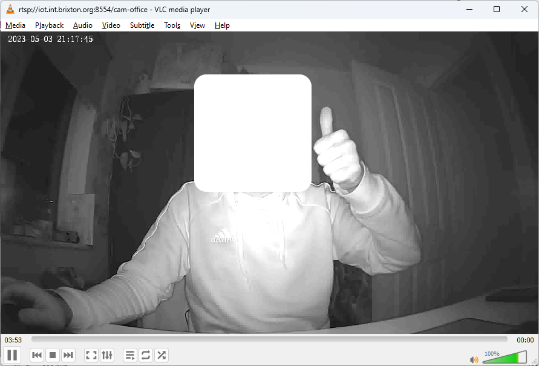

# tutk-ipcamera-proxy

## Overview

Python packages and scripts to interact with generic Chinese IP cameras using the popular TUTK protocol.  The code is split into 3 parts:

1. Example script `tutk_ipcamera_proxy.py` which uses the `tutk_proxy` package.  This script has basic support for device discovery, syncing the time and streaming video.
2. The `tutk_proxy` package, which provides python-friendly functions to scan for devices, representing devices as a model and performing actions against devices.
3. The `tutk_wrapper` package, which provides a limited Python interface for the underlying TUTK Linux library (`.so`).  It interacts with library devices using the `ctypes` package.

## Usage

### Overview

```
usage: tutk_ipcamera_proxy.py [-h] [-v | -q] {scan,stream,sync} ...

positional arguments:
  {scan,stream,sync}

optional arguments:
  -h, --help          show this help message and exit
  -v, --verbose       set log level to DEBUG
  -q, --quiet         set log level to CRITICAL
```

### Action: scan

Scans the local subnet for devices, and prints their information.

```
usage: tutk_ipcamera_proxy.py scan [-h] [-t TIMEOUT]

optional arguments:
  -h, --help            show this help message and exit
  -t TIMEOUT, --timeout TIMEOUT
                        timeout (ms) for scanning for / connecting to devices
```

### Action: sync

Syncs the local time to the remote device with uid `DEVICEUID`.  You might want to do this on a schedule to keep your crappy IOT device synced correctly.  Otherwise, mine drift a minute every week or so.

```
usage: tutk_ipcamera_proxy.py sync [-h] -d DEVICEUID -u USERNAME -p PASSWORD [-t TIMEOUT]

optional arguments:
  -h, --help            show this help message and exit
  -d DEVICEUID, --deviceuid DEVICEUID
                        device UID
  -u USERNAME, --username USERNAME
                        username to use to connect to device
  -p PASSWORD, --password PASSWORD
                        password to use to connect to device
  -t TIMEOUT, --timeout TIMEOUT
                        timeout for scanning and connecting to devices
```

### Action: stream

Streams video from the remote device with uid `DEVICEUID` to file `FILENAME`.

```
usage: tutk_ipcamera_proxy.py stream [-h] -d DEVICEUID -u USERNAME -p PASSWORD [-t TIMEOUT] -f FILENAME

optional arguments:
  -h, --help            show this help message and exit
  -d DEVICEUID, --deviceuid DEVICEUID
                        device UID
  -u USERNAME, --username USERNAME
                        username to use to connect to device
  -p PASSWORD, --password PASSWORD
                        password to use to connect to device
  -t TIMEOUT, --timeout TIMEOUT
                        timeout for scanning and connecting to devices
  -f FILENAME, --filename FILENAME
                        file to write video frames to; use - for stdout
```

## Examples

`tutk_proxy` and `tutk_wrapper` are made as standalone packages.  You can install these independently to support your own code, although `tutk_proxy` depends on `tutk_wrapper`.  The script `tutk_ipcamera_proxy.py` uses the `tutk_proxy` package.  If you just want to use `tutk_ipcamera_proxy.py` then you can do so as follows:

### 1. Scan Local Subnet

```
user@iot:~/tutk-ipcamera-proxy/code$ python3 tutk_ipcamera_proxy.py scan
[snip]
2023-05-04 10:19:48,543 [INFO] [tutk_proxy.proxy.scan_local_subnet]: attempting to scan local subnet for devices
[snip]
2023-05-04 10:19:53,545 [INFO] [__main__.action_scan]: received 1 device
2023-05-04 10:19:53,545 [INFO] [__main__.action_scan]: device: uid=HBNASLSCFC1MN4Y9221A, ip=10.4.1.11, port=36377, name=010124b21d6049020100014500200002
```

### 2. Sync Time

```
user@iot:~/tutk-ipcamera-proxy/code$ python3 tutk_ipcamera_proxy.py sync -t 1000 -d HBNASLSCFC1MN4Y9221A -u admin -p password
[snip]
2023-05-04 10:21:53,544 [INFO] [TutkDevice.sync_time]: synced time
```

### 3. Stream Video

```
user@iot:~/tutk-ipcamera-proxy/code$ python3 tutk_ipcamera_proxy.py stream -t 1000 -d HBNASLSCFC1MN4Y9221A -u admin -p password -f /tmp/test
[snip]
2023-05-04 10:23:11,007 [INFO] [TutkDevice.stream_to]: got av channel
2023-05-04 10:23:11,007 [INFO] [TutkDevice.stream_to]: attempting to send ioctrlmsg to start video
2023-05-04 10:23:11,241 [INFO] [TutkDevice.stream_to]: sent ioctrlmsg to start video
2023-05-04 10:23:11,241 [INFO] [TutkDevice.stream_to]: attempting to start video streaming (blocking)
2023-05-04 10:23:41,061 [INFO] [TutkDevice.stream_to]: status: TutkDeviceStreamInfo(frames_received=447, fps=14, last_frame_jpg=None, last_frame_received_time=1683192221, last_frame_size=6569, dropped_frames=1, video_format=<StreamFormat.MEDIA_CODEC_VIDEO_H264: 78>)
2023-05-04 10:24:11,063 [INFO] [TutkDevice.stream_to]: status: TutkDeviceStreamInfo(frames_received=894, fps=14, last_frame_jpg=None, last_frame_received_time=1683192251, last_frame_size=4620, dropped_frames=1, video_format=<StreamFormat.MEDIA_CODEC_VIDEO_H264: 78>)
```

Status messages repeat every 30s to give current information that things are working.  The raw frames are written to the file; there is no processing.  That means the frames are in their raw format.  For my devices, that's `H264`.  You may be able to change this using the native app/functionality your device came with.

You may need to process the output using an intermediate tool, or put the frames into a container format like `mkv` using `ffmpeg`.  For instance, you could add some scaffolding around the output file.  To get an `rtsp` stream, which is compatible with camera monitoring software such as `zoneminder`, you might use `ffmpeg` to read the raw video frames and forward them to an `rtsp` server such as [mediamtx](https://github.com/aler9/mediamtx):

```
python3 tutk_ipcamera_proxy.py stream -t 1000 -d HBNASLSCFC1MN4Y9221A -u admin -p password -f /dev/stdout 2>stream.log | ffmpeg -i - -f rtsp -rtsp_transport tcp rtsp://localhost:8554/cam-office &>/dev/null
```

Now, you can use VLC to open the stream:



Obviously, you may want to use these in `systemd` unit files or cron scripts to keep everything running correctly.

## Future

There is a lot to add.  I don't know if I'll bother, as this setup works for getting video frames out from my IOT devices and keeping their time synced.